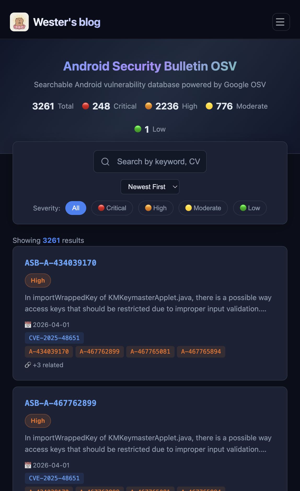

<p align="center">
  
</p>

## 🎯 Work

```
╔════════════════════════════════════════════════════════════════╗
║  🔒 Security Researcher & Bug Hunter from China                ║
║  🎯 Focus: AI security | AI safety | Offensive Security        ║
╚════════════════════════════════════════════════════════════════╝
```

---

## 🔥 Android Security Bulletin OSV Search

<p align="center">
  <a href="https://lightrains.org/android-osv/">
    
  </a>
</p>

### [🔍 Try it now →](https://lightrains.org/android-osv/)

A **fully searchable** Android vulnerability database powered by **Google OSV**, containing **3,261+ entries** (ASB + PUB) with real-time filtering by severity, keyword, CVE ID, component name, and more.

#### ✨ Why this over the official [OSV.dev](https://osv.dev/)?

| Feature | **This Tool** | Official OSV.dev |
|---------|---------------|------------------|
| **Full-text search** | ✅ Search by **any keyword** (component, description, CVE...) | ❌ Only vulnerability ID lookup |
| **Severity filter** | ✅ One-click: Critical / High / Moderate / Low | ❌ No severity filtering |
| **Offline-capable** | ✅ All data client-side, instant response | ❌ Server round-trip per query |
| **Mobile-friendly** | ✅ Responsive with hamburger nav | ⚠️ Limited on mobile |
| **Data coverage** | ✅ **3,261 entries** (ASB + legacy PUB) | Same source, different UX |

> 💡 Data from [Google OSV](https://osv.dev/) · Auto-updated bi-monthly via GitHub Actions

---

## 🤝 Connect With Me

<p align="center">
  <a href="https://github.com/We5ter">
    
  </a>
  <a href="https://x.com/wester0x01">
    
  </a>
  <a href="mailto:alert@lightrains.org">
    
  </a>
  <a href="https://lightrains.org">
    
  </a>
</p>


<p align="center">

</p>
